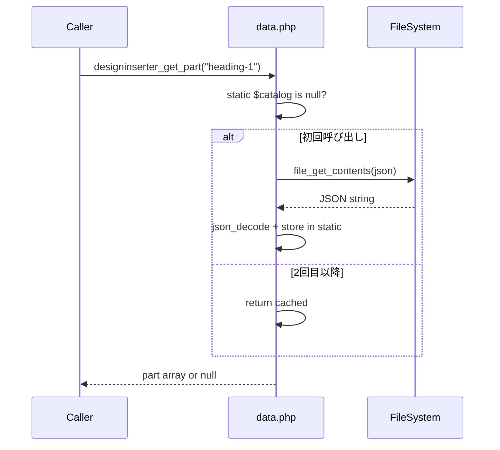
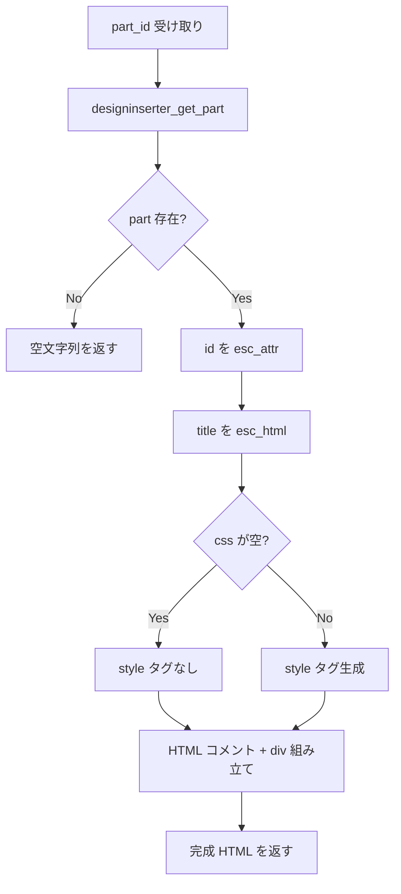
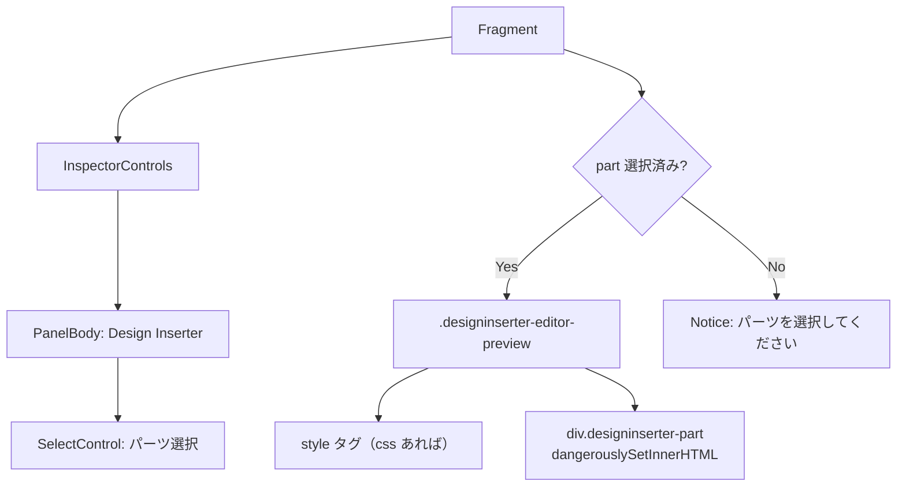
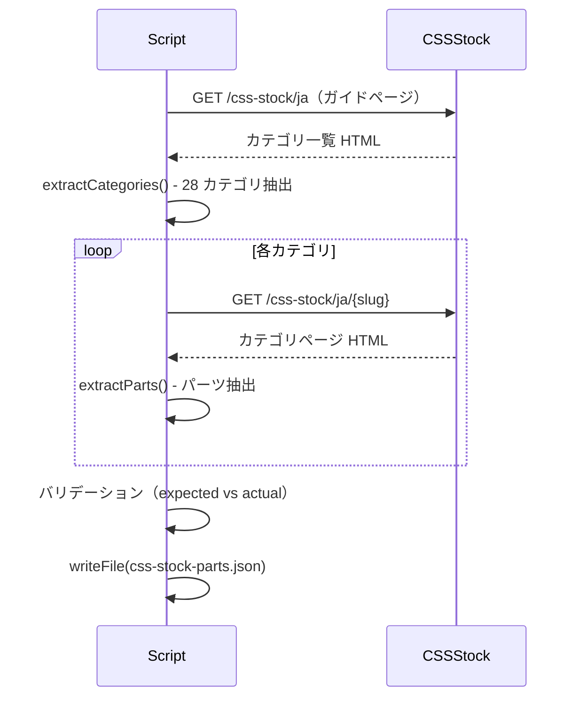
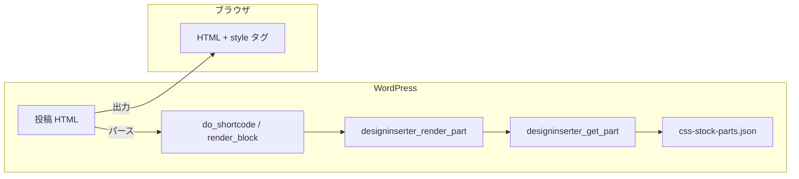
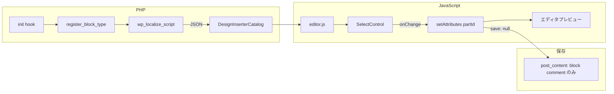
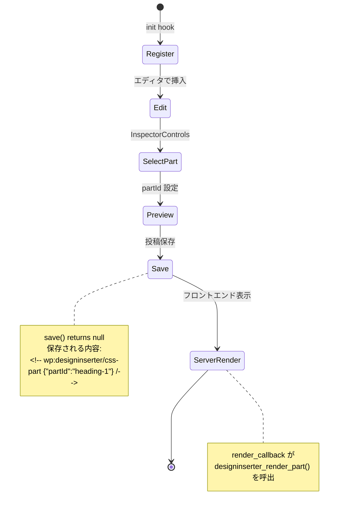

# 詳細設計書

## ファイル構成

```
wp-content/plugins/designinserter/
├── designinserter.php          # プラグインエントリポイント（定数定義 + require）
├── index.php                   # 直接アクセス防止
├── includes/
│   ├── index.php               # 直接アクセス防止
│   ├── data.php                # カタログデータ読み込み・キャッシュ・検索
│   ├── render.php              # パーツ HTML/CSS レンダリング + ショートコード登録
│   ├── block.php               # Gutenberg ブロック登録 + render_callback
│   └── admin.php               # 管理画面メニュー・ページ
├── assets/
│   ├── editor.js               # Gutenberg エディタ UI（ブロック定義）
│   └── editor.css              # エディタプレビュー用スタイル
├── data/
│   └── css-stock-parts.json    # スクレイプ済みカタログ（222 パーツ）
scripts/
└── scrape-css-stock.mjs        # CSS Stock スクレイパー（Node.js）
```

---

## コンポーネント詳細設計

### 1. designinserter.php — プラグインエントリポイント

**責務:** WordPress プラグインヘッダー定義、定数定義、モジュール読み込み

**定数一覧:**

| 定数 | 値 | 用途 |
|------|-----|------|
| `DESIGNINSERTER_VERSION` | `'0.1.0'` | アセットキャッシュバスト |
| `DESIGNINSERTER_PLUGIN_FILE` | `__FILE__` | プラグインファイルパス |
| `DESIGNINSERTER_PLUGIN_DIR` | `plugin_dir_path(__FILE__)` | ディレクトリパス |
| `DESIGNINSERTER_PLUGIN_URL` | `plugin_dir_url(__FILE__)` | URL パス |
| `DESIGNINSERTER_SOURCE_URL` | CSS Stock URL | フォールバック表示用 |

**読み込み順序:**

```php
require_once ... 'includes/data.php';    // 1. データ層（他モジュールが依存）
require_once ... 'includes/render.php';  // 2. レンダリング（data に依存）
require_once ... 'includes/block.php';   // 3. ブロック登録（data + render に依存）
require_once ... 'includes/admin.php';   // 4. 管理画面（data に依存）
```

### 2. includes/data.php — カタログローダー

**責務:** JSON カタログの読み込み、static キャッシュ、パーツ検索

**関数設計:**

```
designinserter_get_catalog_path() → string
  - カタログ JSON のファイルシステムパスを返す

designinserter_get_catalog() → array
  - static 変数で 1 リクエスト内キャッシュ
  - ファイル不在時は空カタログを返す
  - JSON デコード失敗時も空カタログ（サイレント degradation）

designinserter_get_parts() → array
  - catalog['parts'] を返すヘルパー

designinserter_get_part( $part_id ) → array|null
  - sanitize_key() で ID を正規化
  - 線形探索（222 件なので O(n) で十分）
  - 見つからない場合は null
```

**キャッシュ戦略:**



### 3. includes/render.php — レンダラー

**責務:** パーツ ID からフロントエンド HTML 文字列を生成、ショートコード登録

**designinserter_render_part( $part_id ) の処理フロー:**



**出力テンプレート:**

```
\n<!-- Design Inserter: {title} | Source: {sourceUrl} -->\n
{style タグ（css が空でない場合のみ）}
<div class="designinserter-part" data-designinserter-id="{id}" aria-label="{title}">
{html（raw 出力）}
</div>\n
```

**ショートコード登録:**

```php
add_shortcode( 'designinserter_part', 'designinserter_shortcode' );
```

`shortcode_atts` で `id` 属性のみ受け付け、`designinserter_render_part` に委譲。

### 4. includes/block.php — Gutenberg ブロック登録

**責務:** ブロック登録、エディタアセット読み込み、カタログのクライアント注入

**フック:** `add_action( 'init', 'designinserter_register_block' )`

**処理内容:**

1. `wp_register_script` — editor.js を登録（依存: wp-blocks, wp-element, wp-components, wp-block-editor, wp-i18n）
2. `wp_register_style` — editor.css を登録
3. `wp_localize_script` — カタログ全体を `DesignInserterCatalog` としてクライアント注入
4. `register_block_type` — dynamic block 登録（`render_callback` 指定）

**render_callback:**

```php
function designinserter_render_block( $attributes ) {
    $part_id = isset( $attributes['partId'] ) ? $attributes['partId'] : '';
    return designinserter_render_part( $part_id );
}
```

### 5. includes/admin.php — 管理画面

**責務:** 設定メニュー追加、管理ページ表示

**フック:** `add_action( 'admin_menu', 'designinserter_admin_menu' )`

**ページ情報:**

- メニュー位置: Settings > Design Inserter
- ページスラッグ: `designinserter`
- 表示内容: パーツ件数、ソース URL リンク、ショートコード例

### 6. assets/editor.js — Gutenberg エディタ UI

**責務:** ブロック定義（edit / save）、パーツ選択 UI、エディタプレビュー

**構造:** IIFE（ビルドステップ不要）

```javascript
( function( blocks, element, blockEditor, components, i18n ) {
    // ...
} )( wp.blocks, wp.element, wp.blockEditor, wp.components, wp.i18n );
```

**内部関数:**

| 関数 | 説明 |
|------|------|
| `getPart( partId )` | カタログから ID でパーツを検索 |
| `getOptions()` | SelectControl 用のオプション配列生成 |

**edit コンポーネント:**



**save 関数:** `return null` — Dynamic block のためクライアントサイド保存なし。

### 7. assets/editor.css — エディタスタイル

**責務:** エディタプレビューのコンテナスタイル

```css
.designinserter-editor-preview {
    border: 1px solid #dcdcde;
    padding: 24px;
    background: #fff;
}
```

### 8. scripts/scrape-css-stock.mjs — スクレイパー

**責務:** CSS Stock サイトからパーツデータを収集し JSON カタログを生成

**処理フロー:**



**ヘルパー関数:**

| 関数 | 説明 |
|------|------|
| `decodeHtml(value)` | HTML エンティティをデコード |
| `stripTags(value)` | タグ除去 + デコード |
| `normalizeCode(value)` | コードブロックの正規化（改行・インデント） |
| `fetchText(url)` | HTTP GET + エラーチェック |
| `extractCategories(html)` | ガイドページからカテゴリ情報を正規表現で抽出 |
| `extractParts(html, category)` | カテゴリページからパーツを抽出 |

---

## データフロー図

### フロントエンド表示フロー



### エディタフロー



---

## ブロックライフサイクル

### 登録 → 編集 → 保存 → 表示



### 投稿に保存されるブロックマークアップ

```html
<!-- wp:designinserter/css-part {"partId":"heading-1"} /-->
```

属性のみ保存され、HTML は含まない。フロントエンド表示時に毎回サーバーサイドレンダリングされる。

---

## エラーハンドリング

| 状況 | 挙動 | 根拠 |
|------|------|------|
| カタログ JSON 不在 | 空カタログを返す（エラー非表示） | プラグイン有効化直後の初期状態を許容 |
| JSON デコード失敗 | 空カタログを返す | サイレント degradation |
| 不正なパーツ ID | `designinserter_render_part` が空文字列を返す | フロントエンドに何も表示しない |
| 存在しないパーツ ID | 同上 | カタログ更新で削除されたパーツへの graceful degradation |
| エディタで未選択 | Notice コンポーネントでガイダンス表示 | ユーザーに操作を促す |
| CSS が空のパーツ | `<style>` タグを出力しない | SVG ローディング等の正常ケース |

---

## 拡張ポイント

### 短期的拡張（v1.x）

| 拡張 | 実装方針 |
|------|----------|
| カテゴリ絞り込み | `getOptions()` にカテゴリフィルター追加 |
| 検索 UI | `SelectControl` を `ComboboxControl` に変更 |
| カラーカスタマイズ | `inputs` フィールドを InspectorControls の ColorPicker に接続 |
| プレビュー画像 | `previewImage` URL をエディタのサムネイルに表示 |

### 中長期的拡張

| 拡張 | 実装方針 |
|------|----------|
| CSS スコープ分離 | セレクタプレフィクサー or Shadow DOM |
| Block Patterns | 人気パーツのみ厳選して Pattern 登録 |
| Media Library 連携 | placeholder 画像パスを WP 添付ファイルに差し替え |
| REST API | `wp-json/designinserter/v1/parts` エンドポイント追加 |
| 自動更新 | WP-Cron + diff detection + admin 通知 |

### フック（将来的に追加を検討）

| フック名 | タイプ | 用途 |
|----------|--------|------|
| `designinserter_render_output` | filter | レンダリング HTML のカスタマイズ |
| `designinserter_catalog_loaded` | action | カタログロード後の処理追加 |
| `designinserter_part_css` | filter | CSS 出力のカスタマイズ・プレフィクス追加 |
