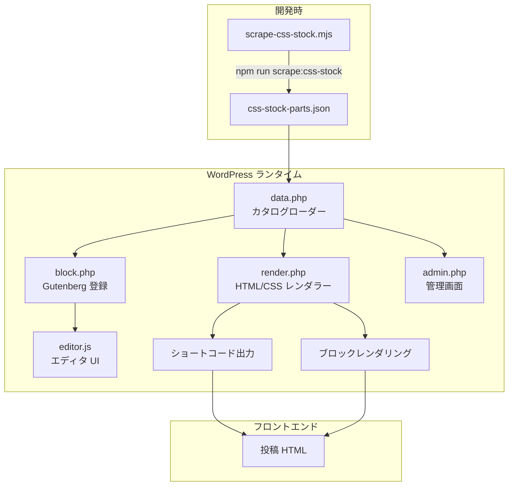
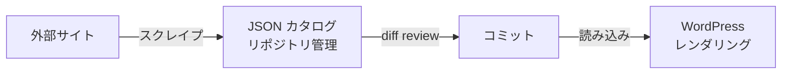

# 技術仕様書

## システムアーキテクチャ

### 全体構成



### レイヤー構成

| レイヤー | 責務 | ファイル |
|----------|------|----------|
| データ | カタログ JSON の読み込み・キャッシュ・検索 | `includes/data.php` |
| レンダリング | パーツ HTML/CSS の組み立て・出力 | `includes/render.php` |
| ブロック | Gutenberg ブロック登録・エディタスクリプト注入 | `includes/block.php` |
| 管理 | 設定ページ UI | `includes/admin.php` |
| エディタ | ブロック選択 UI・プレビュー | `assets/editor.js`, `assets/editor.css` |
| スクレイパー | 外部サイトからのデータ収集 | `scripts/scrape-css-stock.mjs` |

---

## データモデル

### カタログ JSON スキーマ

ファイルパス: `wp-content/plugins/designinserter/data/css-stock-parts.json`

```json
{
  "sourceName": "Design Parts",
  "sourceUrl": "https://pote-chil.com/css-stock/ja",
  "sourceNotice": "string — ライセンス表記",
  "scrapedAt": "2026-05-01T12:38:07.170Z",
  "expectedTotal": 222,
  "total": 222,
  "categories": [ /* Category[] */ ],
  "parts": [ /* Part[] */ ]
}
```

### Category オブジェクト

| フィールド | 型 | 説明 | 例 |
|------------|-----|------|-----|
| `slug` | string | カテゴリ識別子 | `"heading"` |
| `label` | string | 日本語表示名 | `"見出し"` |
| `url` | string | 外部サイトのカテゴリページ URL | `"https://pote-chil.com/css-stock/ja/heading"` |
| `sectionCount` | number | カテゴリ内セクション数 | `5` |
| `expectedPartCount` | number | カテゴリ内パーツ数 | `39` |

### Part オブジェクト

| フィールド | 型 | 説明 | 例 |
|------------|-----|------|-----|
| `id` | string | プラグイン内一意 ID | `"heading-1"` |
| `sourcePartId` | number | 外部サイト側のパーツ番号 | `1` |
| `category` | string | カテゴリ slug | `"heading"` |
| `categoryLabel` | string | カテゴリ表示名 | `"見出し"` |
| `categoryTitle` | string | カテゴリページタイトル | `"HTML・CSSでつくるおしゃれな見出しのデザイン39選"` |
| `section` | string | セクション名 | `"シンプルな見出し"` |
| `title` | string | パーツタイトル | `"左線"` |
| `html` | string | パーツの HTML コード | `"<h2 class=\"heading-1\">..."` |
| `css` | string | パーツの CSS コード（空文字可） | `".heading-1 { ... }"` |
| `inputs` | Input[] | カスタマイズ可能パラメータ | `[{"label": "左線の色", "defaultValue": "#2589d0"}]` |
| `previewImage` | string | 同梱プレビュー画像の相対パス | `"assets/previews/heading-1.svg"` |
| `sourceUrl` | string | 元パーツの URL | `"https://pote-chil.com/css-stock/ja/heading#1"` |

### Input オブジェクト

| フィールド | 型 | 説明 |
|------------|-----|------|
| `label` | string | 入力ラベル |
| `defaultValue` | string | デフォルト値（カラーコード等） |

### ID 生成規則

パーツ ID は `{categorySlug}-{sourcePartId}` の形式で生成される。

```
heading-1, heading-2, ..., heading-39
button-1, button-2, ..., button-35
box-1, box-2, ..., box-21
```

---

## API 仕様

### ショートコード

```
[designinserter_part id="<part-id>"]
```

| パラメータ | 必須 | 説明 |
|-----------|------|------|
| `id` | Yes | カタログ内のパーツ ID（例: `heading-1`） |

**出力例:**

```html
<!-- Design Inserter: 左線 | Source: https://pote-chil.com/css-stock/ja/heading#1 -->
<style data-designinserter-style="heading-1">
.heading-1 {
    padding: .5em .7em;
    border-left: 5px solid #2589d0;
    color: #333333;
}
</style>
<div class="designinserter-part" data-designinserter-id="heading-1" aria-label="左線">
<h2 class="heading-1">CSS見出しデザイン</h2>
</div>
```

### Gutenberg ブロック

| 属性 | 型 | デフォルト | 説明 |
|------|-----|-----------|------|
| `partId` | string | `""` | 選択されたパーツ ID |

**ブロック名:** `designinserter/css-part`

**登録パラメータ:**

```php
register_block_type( 'designinserter/css-part', array(
    'api_version'     => 2,
    'editor_script'   => 'designinserter-editor',
    'editor_style'    => 'designinserter-editor',
    'attributes'      => array(
        'partId' => array( 'type' => 'string', 'default' => '' ),
    ),
    'render_callback' => 'designinserter_render_block',
) );
```

### PHP 関数 API

| 関数 | 戻り値 | 説明 |
|------|--------|------|
| `designinserter_get_catalog()` | array | カタログ全体（parts, categories, sourceUrl, scrapedAt） |
| `designinserter_get_parts()` | array | パーツ配列 |
| `designinserter_get_part( $id )` | array\|null | ID でパーツを検索 |
| `designinserter_render_part( $id )` | string | パーツの HTML 出力文字列 |

---

## CSS レンダリング仕様

### 出力構造

```html
<!-- Design Inserter: {title} | Source: {sourceUrl} -->
<style data-designinserter-style="{id}">
{css}
</style>
<div class="designinserter-part" data-designinserter-id="{id}" aria-label="{title}">
{html}
</div>
```

### CSS 空パーツ（SVG ローディング等）

CSS が空文字列のパーツ（SVG アニメーション等）は `<style>` タグを出力しない。

```php
$style = '' !== trim( $css )
    ? sprintf( "<style ...>\n%s\n</style>\n", $id, $css )
    : '';
```

### 許可リスト方式

- カタログ JSON に存在する ID のみレンダリング可能
- `designinserter_get_part()` が `null` を返した場合、空文字列を出力
- 不正な ID / 存在しない ID はサイレントに無視（エラー非表示）

### スコープ

- 現状: グローバル CSS（デザインパーツのクラス名をそのまま使用）
- デザインパーツのクラス名形式: `.heading-1`, `.button-5`, `.box-3` 等
- 衝突が発生した場合の対策: selector prefixer 追加を検討

---

## セキュリティ仕様

### 信頼モデル



| ポイント | 方針 |
|----------|------|
| カタログデータ | リポジトリに格納されたローカルファイル = 信頼データ |
| `wp_kses_post` | **適用しない** — form/input/svg が破壊されるため |
| パーツ ID | `sanitize_key()` でサニタイズ後、カタログ照合 |
| 管理画面アクセス | `manage_options` capability 必須 |
| カタログ更新 | 手動スクレイプ → git diff review → コミット |
| ソース URL | `esc_url()` でエスケープして HTML コメントに出力 |
| タイトル表示 | `esc_html()` でエスケープ |

### wp_kses_post を使わない理由

デザインパーツには以下の要素が含まれる:

- `<input type="checkbox">` / `<input type="radio">` — タブ・トグル UI
- `<svg>` / `<path>` / `<circle>` — ローディングアニメーション
- `<label for="...">` — フォームコントロール
- `style` 属性 — インラインスタイル

`wp_kses_post` はこれらの多くを除去するため、カタログを信頼済みローカルデータとして raw 出力する方針を採用している。

---

## エディタ連携仕様

### スクリプト依存関係

```php
wp_register_script(
    'designinserter-editor',
    DESIGNINSERTER_PLUGIN_URL . 'assets/editor.js',
    array( 'wp-blocks', 'wp-element', 'wp-components', 'wp-block-editor', 'wp-i18n' ),
    DESIGNINSERTER_VERSION,
    true
);
```

### カタログ注入

```php
wp_localize_script(
    'designinserter-editor',
    'DesignInserterCatalog',
    designinserter_get_catalog()
);
```

エディタ側では `window.DesignInserterCatalog` としてアクセス可能。

### エディタプレビュー

- 選択パーツの CSS を `<style>` 要素としてインライン注入
- HTML は `dangerouslySetInnerHTML` で描画
- `.designinserter-editor-preview` でボーダー・パディング付きコンテナに格納
