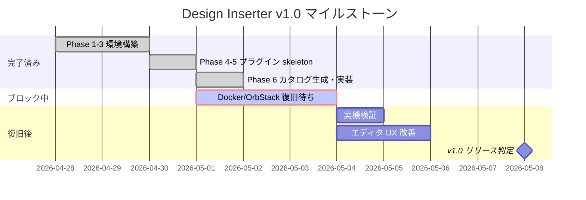

# 作業計画書

## 完了済みフェーズ

### Phase 1: リポジトリ初期化

- `musashipaint` リポジトリを clone し `wordpress-plugin-designinserter` にリネーム
- リモート origin を削除
- 旧プロジェクト名の参照を確認

### Phase 2: テーマ整理

- `muashi-en` テーマを削除
- `muashi` テーマを残置（Phase 3 で置換予定）

### Phase 3: YAGNI 削除

- Docker 環境を 1 MySQL + 1 WordPress に縮退
- 旧テーマ・プラグイン・CI・テスト・VRT・gulp 等を全削除
- `wp-content/themes/designinserter-dev` 最小テーマを作成
- `package.json` を Design Inserter 用に更新
- `docker compose config --quiet` で構文検証済み

### Phase 4: WordPress 初期化（部分完了）

- Docker context = `orbstack` を確認
- OrbStack 起動/再起動を試行
- **ブロッカー発生:** OrbStack VM hang により実機検証不可

### Phase 5: プラグイン skeleton

- `wp-content/plugins/designinserter/` ディレクトリ構成を作成
- `designinserter.php` プラグインヘッダー + 定数定義
- `includes/data.php` カタログローダー
- `includes/render.php` レンダラー + ショートコード
- `includes/block.php` Gutenberg ブロック登録
- `includes/admin.php` 管理画面
- `assets/editor.js` + `assets/editor.css` エディタ UI

### Phase 6: 本体実装 + カタログ生成

- `scripts/scrape-css-stock.mjs` スクレイパー作成
- `npm run scrape:css-stock` 実行: 28 カテゴリ / 222 パーツ抽出成功
- `data/css-stock-parts.json` 生成
- SVG-only パーツ（CSS 空）の `<style>` 非出力対応
- `IMPLEMENTATION_PLAN.md` 作成

---

## 現在のブロッカー

### Docker/OrbStack VM Hang

| 項目 | 状態 |
|------|------|
| 症状 | `docker compose down -v`, `docker info`, `orb status` が応答しない |
| ログ | `VM hang` / `health check failed` / `context deadline exceeded` |
| 影響範囲 | WordPress 管理画面での全 UI 検証がブロック |
| 回避策 | なし（PHP もローカル未インストール） |
| 復旧条件 | OrbStack VM の再起動または再インストール |

### ローカル PHP 不在

| 項目 | 状態 |
|------|------|
| 影響 | PHP 構文検査 (`php -l`) が実行不可 |
| 回避策 | Docker 復旧後にコンテナ内で実行 |

---

## 残タスク（優先度順）

### Priority 1: Docker 復旧後の実機検証

Docker daemon が復旧し次第、以下を順次実行する:

| # | タスク | 検証内容 |
|---|--------|----------|
| 1 | `docker compose down -v` | ボリュームクリア |
| 2 | `docker compose up -d --build` | コンテナ起動 |
| 3 | `http://localhost:8080` アクセス | WordPress インストール画面表示 |
| 4 | WP-CLI 初期インストール | `wp core install` + admin ユーザー作成 |
| 5 | `wp plugin activate designinserter` | プラグイン有効化 |
| 6 | PHP 構文検査 | `php -l` 全ファイル |
| 7 | ブロック挿入テスト | エディタでパーツ選択 → プレビュー確認 |
| 8 | ショートコードテスト | `[designinserter_part id="heading-1"]` → フロントエンド表示 |
| 9 | 管理画面確認 | Settings > Design Inserter ページ表示 |
| 10 | CSS 衝突確認 | テーマとの class 名衝突チェック |

### Priority 2: エディタ UX 改善

| # | タスク | 理由 |
|---|--------|------|
| 1 | カテゴリ絞り込み UI | 222 パーツの flat list は使いづらい |
| 2 | 検索機能 | パーツ名やカテゴリでのフィルタリング |
| 3 | プレビュー画像表示 | `previewImage` フィールドの活用 |

### Priority 3: 安定性・品質

| # | タスク | 理由 |
|---|--------|------|
| 1 | CSS スコープ分離検討 | テーマ衝突時の対策準備 |
| 2 | PHPUnit テスト | `designinserter_get_part()` / `designinserter_render_part()` |
| 3 | E2E テスト (Playwright) | ブロック挿入 → フロントエンド表示の自動検証 |
| 4 | PHP_CodeSniffer | WordPress Coding Standards 準拠 |

### Priority 4: 将来拡張

| # | タスク | 理由 |
|---|--------|------|
| 1 | カラーカスタマイズ UI | `inputs` フィールドの活用 |
| 2 | Block Patterns（厳選） | 人気パーツのみ Pattern 化 |
| 3 | Media Library 連携 | placeholder 画像の差し替え |
| 4 | スクレイパー定期実行 | 新パーツ追加への追従 |
| 5 | REST API | 外部連携・カスタム UI 用 |

---

## v1.0 Definition of Done

### 必須条件（全て達成で v1.0 リリース）

| # | 条件 | 検証方法 |
|---|------|----------|
| 1 | プラグインが WordPress 管理画面で有効化できる | UI 確認 |
| 2 | Gutenberg ブロックでパーツ選択・プレビューが動作する | エディタ操作 |
| 3 | 選択パーツがフロントエンドで正しく表示される | ページ閲覧 |
| 4 | ショートコードで同一パーツが表示できる | Classic Editor / テキストウィジェット |
| 5 | 222 パーツ全てが選択可能 | セレクトボックス確認 |
| 6 | SVG ローディングパーツが正しく表示される | CSS 空パーツの動作確認 |
| 7 | form/input 系パーツが機能する | タブ・トグル・チェックボックスの操作 |
| 8 | PHP エラー・警告が発生しない | `WP_DEBUG=true` で確認 |
| 9 | JavaScript エラーが発生しない | ブラウザコンソール確認 |
| 10 | 管理画面にパーツ数とソース情報が表示される | Settings > Design Inserter |
| 11 | プラグイン停止時にフロントエンド出力が消える | graceful degradation |
| 12 | ソース帰属が HTML コメントで出力される | ソース表示確認 |

### 品質基準

| 項目 | 基準 |
|------|------|
| PHP 構文 | `php -l` 全ファイルエラーなし |
| WordPress 互換性 | WP 6.0+ / PHP 7.4+ |
| ビルドステップ | 不要（Plain JS + PHP のみ） |
| データ整合性 | `expectedTotal === total === 222` |
| セキュリティ | パーツ ID サニタイズ + カタログ allowlist |

---

## マイルストーン

---

## リスク管理

| リスク | 影響 | 対策 |
|--------|------|------|
| OrbStack 長期復旧不能 | 全実機検証がブロック | 代替: Docker Desktop / Colima / リモート WP 環境 |
| CSS Stock サイト構造変更 | スクレイパー破損 | 正規表現ベースのため、変更検知 + 手動修正 |
| CSS クラス名衝突 | テーマ表示崩れ | selector prefixer 追加 or BEM 名前空間 |
| 222 パーツの一括注入 | エディタパフォーマンス低下 | `wp_localize_script` のペイロードサイズ監視 |
| wp_kses_post 非適用 | 悪意あるカタログ更新 | git diff review 必須ワークフロー |
